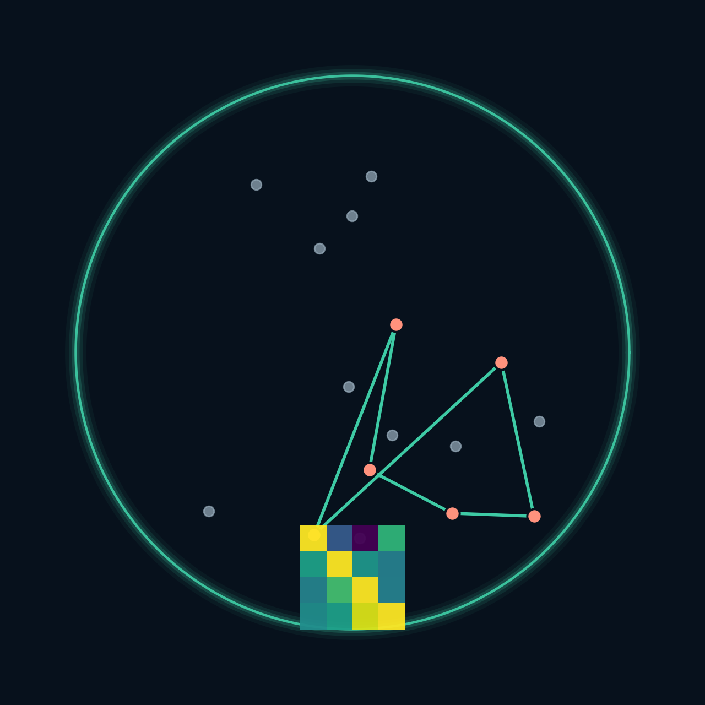
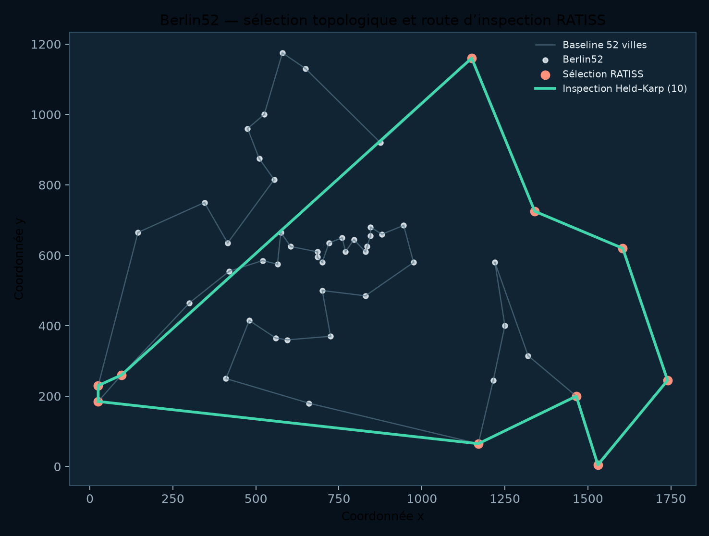
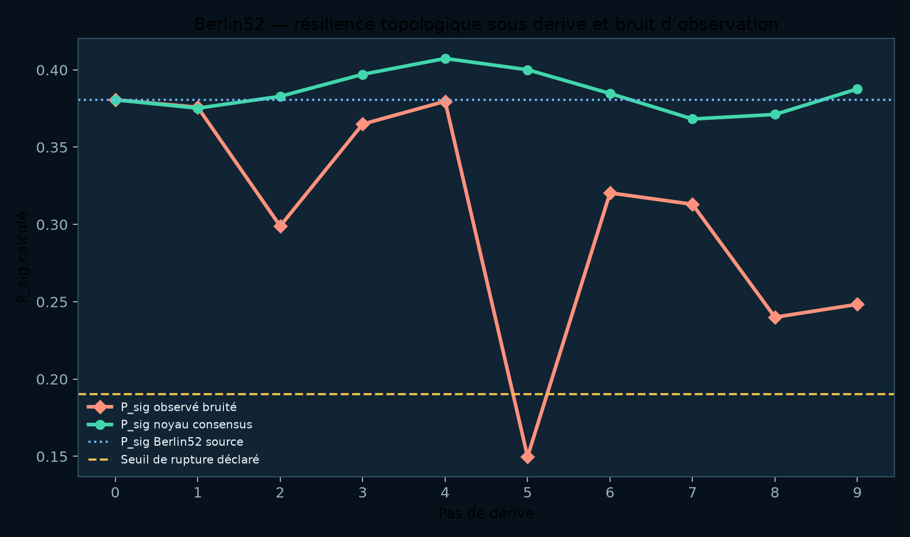
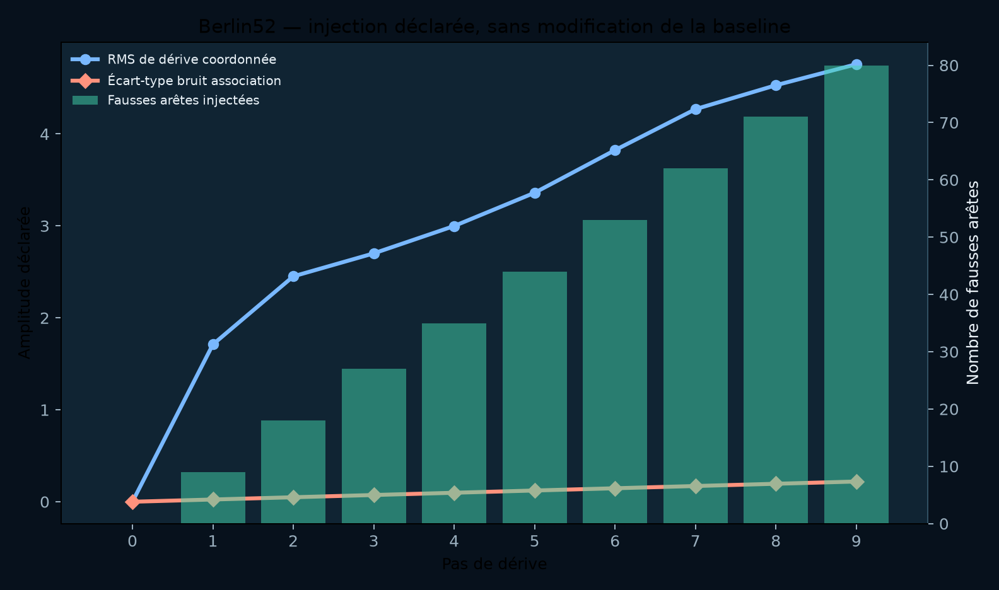
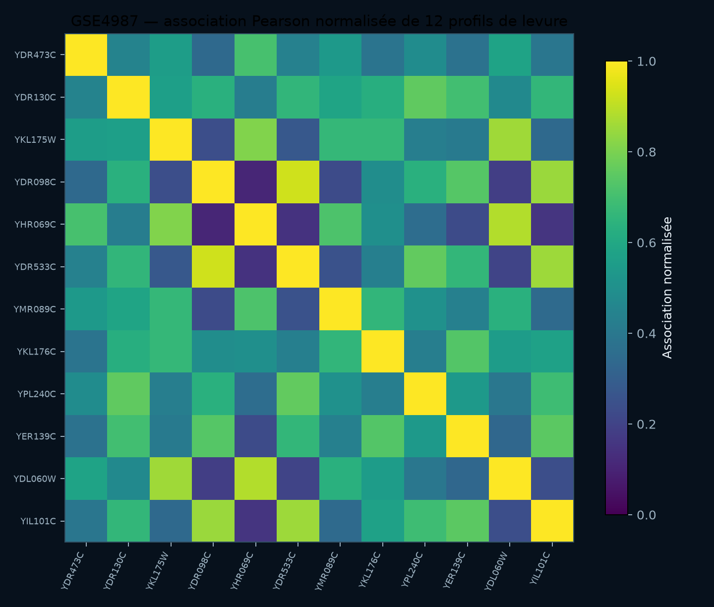
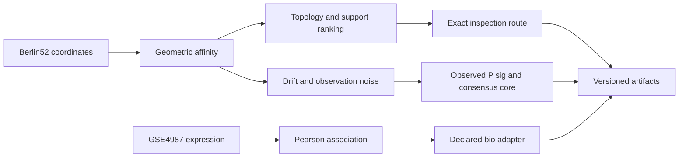

<p align="center">
  
</p>

<h1 align="center">RATISS Jonathan Labs</h1>

<p align="center">
  <strong>Laboratoire de graphes, topologie d'inspection et structures de corrélation</strong><br/>
  TSP sur coordonnées réelles (Berlin52) · résilience topologique sous dérive —<br/>
  ingestion bio descriptive (GSE4987) — artefacts directement réexécutables.
</p>

<p align="center">
  <a href="LICENSE"></a>
  
  
  
  
</p>

<p align="center">
  <em>Architecte & investigateur principal : <strong>Jonathan Evina</strong> ·
  <a href="https://orcid.org/0009-0000-4092-5313">ORCID 0009-0000-4092-5313</a></em>
</p>

---

## Sommaire

1. [Nature du laboratoire](#1-nature-du-laboratoire)
2. [Frontière de revendication](#2-frontière-de-revendication)
3. [Axe 1 — Berlin52 : inspection topologique](#3-axe-1--berlin52--inspection-topologique)
4. [Axe 1 bis — Résilience sous dérive](#4-axe-1-bis--résilience-sous-dérive)
5. [Axe 2 — GSE4987 : association bio descriptive](#5-axe-2--gse4987--association-bio-descriptive)
6. [Architecture des deux axes](#6-architecture-des-deux-axes)
7. [Pile technologique](#7-pile-technologique)
8. [Exécution et reproduction](#8-exécution-et-reproduction)
9. [Tests](#9-tests)
10. [Documentation](#10-documentation)
11. [Citation et licence](#11-citation-et-licence)

---

## 1. Nature du laboratoire

Ce laboratoire teste un principe précis : utiliser une topologie calculée pour **organiser l'inspection** d'un grand graphe, puis préserver la provenance de la donnée source. Deux familles d'entrées réelles sont instrumentées :

| Axe | Donnée réelle | Rôle de RATISS | Sortie |
|---|---|---|---|
| Graphe géométrique et TSP | Coordonnées publiques Berlin52 | Prioriser un sous-ensemble structurel, calculer une route d'inspection locale | Affinité, topologie, sélection de nœuds, route et baseline |
| Ingestion bio descriptive | GSE4987, cycle cellulaire de levure | Importer une association déclarée sans la surinterpréter | Corrélation Pearson normalisée et timeline RATISS descriptive |

## 2. Frontière de revendication

> Le laboratoire ne transforme pas un sous-ensemble d'inspection en solution globale d'optimisation, ne transforme pas une matrice biologique en signal quantique, et le stress de résilience n'est ni un filtre garanti ni un avantage TSP. La route d'inspection résout une **tâche différente** de la baseline globale : elles ne sont pas vendues comme une comparaison de performance.

## 3. Axe 1 — Berlin52 : inspection topologique



Les points gris sont les 52 coordonnées de Berlin52. La ligne grise est une baseline plus-proche-voisin + 2-opt sur l'ensemble complet. Les nœuds corail forment le sous-ensemble de dix villes retenu par support d'affinité géométrique ; la ligne menthe est sa route Held–Karp exacte.

| Mesure observée | Valeur |
|---|---:|
| `P_sig` du graphe d'affinité | `0.3806296964` |
| Betti | `[1, 0, 0]` |
| Taille de l'inspection exacte | 10 villes |
| Coût inspection Held–Karp | `4666.323392758` |
| Coût baseline 52 villes | `8060.651582561` |

## 4. Axe 1 bis — Résilience sous dérive



Un second protocole conserve l'artefact Berlin52 de référence intact, puis applique une dérive de coordonnées gaussienne cumulative, du bruit gaussien aux associations et des fausses arêtes à une copie observée. Le `P_sig` observé et le noyau de consensus temporel sont exportés en deux branches séparées : le noyau est une médiane des matrices déjà observées, jamais une réécriture de la matrice bruitée.



| Mesure | Valeur | Lecture |
|---|---:|---|
| `P_sig` baseline | `0.3806296964` | Référence sur coordonnées intactes |
| Seuil de rupture déclaré (50 %) | `0.1903148482` | Ratio paramétré, pas propriété universelle |
| `P_sig` observé au pas 5 | `0.1497961077` | Franchit le seuil |
| `P_sig` consensus au pas 5 | `0.4000637981` | Ne franchit jamais le seuil |
| Premier franchissement (observé / consensus) | pas 5 / aucun | Stress déterministe, seed `20260823` |

Il s'agit d'un **stress test synthétique** sur les coordonnées Berlin52 réelles, non d'un filtre garanti ni d'un théorème de débruitage.

## 5. Axe 2 — GSE4987 : association bio descriptive



La heatmap provient des douze profils complets de levure sélectionnés dans le jeu GSE4987. La couleur montre l'association Pearson normalisée — ni intensité quantique, ni causalité biologique. L'artefact conserve les labels, les séries d'expression, la matrice Pearson et la matrice normalisée.

| Mesure observée | Valeur |
|---|---:|
| Organisme | *Saccharomyces cerevisiae* |
| Profils de gènes utilisés | 12 |
| `P_sig` du graphe d'associations | `0.099482859` |
| `P_sig` logique RATISS | `null` (entrée non-densité) |
| Inférence clinique ou causale | Aucune |

## 6. Architecture des deux axes



Les deux branches convergent vers le même contrat d'artefact mais gardent des unités, sources et limites différentes. Détail : [`docs/ARCHITECTURE.md`](docs/ARCHITECTURE.md).

## 7. Pile technologique

| Couche | Technologie | Rôle |
|---|---|---|
| Langage | Python ≥ 3.11 | Laboratoire complet |
| Calcul numérique | NumPy ≥ 1.26 | Distances, affinités, matrices d'association |
| Topologie | Vietoris-Rips GF(2) (moteur RATISS) | `P_sig`, Betti, cycles H1 |
| Route d'inspection | Held-Karp exact ≤ 10 nœuds | Route locale exacte sur le sous-ensemble |
| Données | TSPLIB Berlin52 · GSE4987 (SGD) | Coordonnées réelles, expression réelle |
| Visualisation | Matplotlib | Figures dérivées exclusivement des artefacts |
| Artefacts | JSON versionné | `ratiss.tsp.inspection.v1`, `ratiss.topology.resilience.v1`, `ratiss.bio.gse4987.v1` |

Le moteur topologique source ([`ratiss-topological-decoherence-engine`](https://github.com/evinajonathan13-max/ratiss-topological-decoherence-engine)) est une dépendance **explicite par chemin local**.

## 8. Exécution et reproduction

```bash
git clone https://github.com/evinajonathan13-max/Ratiss-Jonathan-Labs-.git
git clone https://github.com/evinajonathan13-max/ratiss-topological-decoherence-engine.git
cd Ratiss-Jonathan-Labs-
python3 -m pip install -e .

# Axe 1 : inspection Berlin52
PYTHONPATH=../ratiss-topological-decoherence-engine/src \
python3 scripts/run_tsp_ratiss.py \
  --engine-src ../ratiss-topological-decoherence-engine/src

# Axe 1 bis : résilience sous dérive
PYTHONPATH=../ratiss-topological-decoherence-engine/src \
python3 scripts/run_topology_resilience.py \
  --engine-src ../ratiss-topological-decoherence-engine/src

# Axe 2 : bio (récupérer d'abord la source publique, voir data/gse4987/README.md)
mkdir -p data/gse4987/raw
curl -L https://sgd-prod-upload.s3.amazonaws.com/S000204339/Pramila_2006_PMID_16912276.zip -o data/gse4987/source.zip
unzip -o data/gse4987/source.zip -d data/gse4987/raw

PYTHONPATH=../ratiss-topological-decoherence-engine/src \
python3 scripts/run_bio_yeast.py \
  --engine-src ../ratiss-topological-decoherence-engine/src

# Figures dérivées des seuls artefacts
python3 scripts/generate_docs_figures.py
```

La résilience est **déterministe** (RNG seedé) : deux exécutions du même profil produisent un artefact identique.

## 9. Tests

```bash
PYTHONPATH=../ratiss-topological-decoherence-engine/src python3 -m pytest -q
```

Les tests contrôlent le parsing Berlin52, la symétrie des affinités, le parsing des profils GSE4987, la normalisation des corrélations, la séparation des branches observée/consensus et l'existence des figures documentaires.

## 10. Documentation

| Document | Fonction |
|---|---|
| [`PROTOCOL.md`](docs/PROTOCOL.md) | Question expérimentale, limites et références sources |
| [`ARCHITECTURE.md`](docs/ARCHITECTURE.md) | Flux Berlin52 et GSE4987 |
| [`RESULTS.md`](docs/RESULTS.md) | Valeurs calculées, comparaison correcte et reproduction |
| [`VISUAL_AUDIT.md`](docs/VISUAL_AUDIT.md) | Lecture vérifiée des graphiques |
| [`RESILIENCE_MODE.md`](docs/RESILIENCE_MODE.md) | Contrat de dérive, bruit et seuils de rupture |
| [`RESILIENCE_VISUAL_AUDIT.md`](docs/RESILIENCE_VISUAL_AUDIT.md) | Vérification des graphiques de résilience |
| [`data/gse4987/README.md`](data/gse4987/README.md) | Procédure de téléchargement de la source bio publique |

## 11. Citation et licence

Distribué sous [licence MIT](LICENSE) — © 2026 Jonathan Evina.

```bibtex
@software{evina_ratiss_jonathan_labs_2026,
  author  = {Evina, Jonathan},
  title   = {RATISS Jonathan Labs: Graph Topology for Structural Inspection
             on Real Berlin52 and Descriptive Bio Data},
  year    = {2026},
  url     = {https://github.com/evinajonathan13-max/Ratiss-Jonathan-Labs-},
  note    = {Inspection topologique et ingestion descriptive ; aucun avantage
             TSP global ni inférence causale revendiqué.}
}
```
