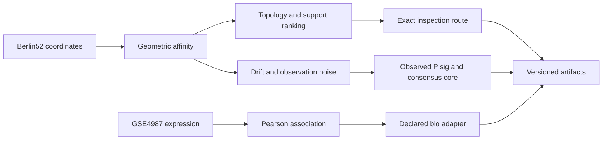

# Ratiss Jonathan Labs

# RATISS Jonathan Labs

> **Laboratoire de graphes, topologie d’inspection et structures de corrélation** — TSP sur coordonnées réelles et ingestion bio descriptive, avec artefacts directement réexécutables.

| Type de projet | Donnée réelle | Rôle de RATISS | Sortie |
|---|---|---|---|
| Graphe géométrique et TSP | Coordonnées publiques Berlin52 | Prioriser un sous-ensemble structurel, calculer une route d’inspection locale | Affinité, topologie, sélection de nœuds, route et baseline |
| Ingestion bio descriptive | GSE4987, cycle cellulaire de levure | Importer une association déclarée sans la surinterpréter | Corrélation Pearson normalisée et timeline RATISS descriptive |

Le laboratoire sert à tester un principe plus large : utiliser une topologie calculée pour **organiser l’inspection** d’un grand graphe, puis préserver la provenance de la donnée source. Il ne transforme pas un sous-ensemble d’inspection en solution globale d’optimisation, et il ne transforme pas une matrice biologique en signal quantique.

## Berlin52 : carte calculée de l’inspection


Les points gris sont les 52 coordonnées de Berlin52. La ligne grise est une baseline plus proche voisin + 2-opt sur l’ensemble complet. Les nœuds corail forment le sous-ensemble de dix villes retenu par support d’affinité géométrique ; la ligne menthe est sa route Held–Karp exacte. Elles résolvent des tâches différentes et ne sont donc pas vendues comme une comparaison de performance globale.

| Mesure observée | Valeur |
|---|---:|
| P sig du graphe d’affinité | 0.3806296964 |
| Betti | `[1, 0, 0]` |
| Taille de l’inspection exacte | 10 villes |
| Coût inspection Held–Karp | 4666.323392758 |
| Coût baseline 52 villes | 8060.651582561 |

## Berlin52 : dérive et résilience topologique


Un second protocole conserve l’artefact Berlin52 de référence intact, puis applique une dérive de coordonnées gaussienne cumulative, du bruit gaussien aux associations et des fausses arêtes à une copie observée. Le `P_sig` observé et le noyau de consensus temporel sont exportés en deux branches : le noyau est une médiane des matrices déjà observées, jamais une réécriture de la matrice bruitée.


La baseline vaut `P_sig=0.3806296964`; le seuil de rupture déclaré est `0.1903148482` (50 %). Dans cette exécution déterministe, la branche observée tombe à `0.1497961077` au pas 5 et franchit le seuil ; le noyau consensus vaut simultanément `0.4000637981` et ne le franchit à aucun pas. Il s’agit d’un stress test synthétique sur les coordonnées Berlin52 réelles, non d’un filtre garanti ni d’un avantage TSP.

## GSE4987 : associations de levure, pas diagnostic


La heatmap provient des douze profils complets de levure sélectionnés dans le jeu GSE4987. La couleur montre l’association Pearson normalisée, non une intensité quantique ni une causalité biologique. L’artefact conserve les labels, les séries d’expression, la matrice Pearson et la matrice normalisée.

| Mesure observée | Valeur |
|---|---:|
| Organisme | *Saccharomyces cerevisiae* |
| Profils de gènes utilisés | 12 |
| P sig du graphe d’associations | 0.099482859 |
| P sig logique RATISS | `null` |
| Inférence clinique ou causale | Aucune |

## Architecture des deux axes



Le schéma complet est dans [`docs/ARCHITECTURE.md`](docs/ARCHITECTURE.md). Les deux branches convergent dans un contrat d’artefact mais gardent des unités, des sources et des limites différentes.

## Lancer les expériences

```bash
git clone https://github.com/evinajonathan13-max/Ratiss-Jonathan-Labs-.git
git clone https://github.com/evinajonathan13-max/ratiss-topological-decoherence-engine.git
cd Ratiss-Jonathan-Labs-
python3 -m pip install -e .

PYTHONPATH=../ratiss-topological-decoherence-engine/src \
python3 scripts/run_tsp_ratiss.py \
  --engine-src ../ratiss-topological-decoherence-engine/src

PYTHONPATH=../ratiss-topological-decoherence-engine/src \
python3 scripts/run_topology_resilience.py \
  --engine-src ../ratiss-topological-decoherence-engine/src \
  --input data/berlin52.tsp \
  --output artifacts/berlin52_topology_resilience.json
```

Pour l’axe bio, récupérer d’abord le fichier public indiqué dans [`data/gse4987/README.md`](data/gse4987/README.md), puis :

```bash
PYTHONPATH=../ratiss-topological-decoherence-engine/src \
python3 scripts/run_bio_yeast.py \
  --engine-src ../ratiss-topological-decoherence-engine/src
```

## Tests et contrôle documentaire

```bash
PYTHONPATH=../ratiss-topological-decoherence-engine/src python3 -m pytest -q
python3 scripts/generate_docs_figures.py
```

Les tests contrôlent le parsing Berlin52, la symétrie des affinités, le parsing des profils GSE4987 et la normalisation des corrélations. Les graphiques sont construits à partir des artefacts JSON versionnés, sans ajout manuel de points.

## Lire, vérifier et prolonger

| Document | Fonction |
|---|---|
| [`PROTOCOL.md`](docs/PROTOCOL.md) | Question expérimentale, limites et références sources |
| [`ARCHITECTURE.md`](docs/ARCHITECTURE.md) | Flux Berlin52 et GSE4987 |
| [`RESULTS.md`](docs/RESULTS.md) | Valeurs calculées, comparaison correcte et reproduction |
| [`VISUAL_AUDIT.md`](docs/VISUAL_AUDIT.md) | Lecture vérifiée des graphiques |
| [`RESILIENCE_MODE.md`](docs/RESILIENCE_MODE.md) | Contrat de dérive, bruit et seuils de rupture Berlin52 |
| [`RESILIENCE_VISUAL_AUDIT.md`](docs/RESILIENCE_VISUAL_AUDIT.md) | Vérification des graphiques de résilience |
| [`data/gse4987/README.md`](data/gse4987/README.md) | Procédure de téléchargement de la source bio publique |

Distribué sous [licence MIT](LICENSE).
