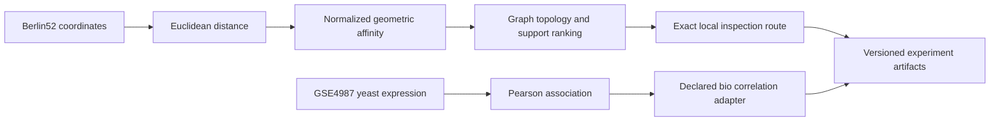

# Architecture des graphes RATISS

L’axe Berlin52 traite une structure géométrique de benchmark. L’axe GSE4987 importe une structure descriptive de corrélation. Les deux partagent un contrat d’artefact, mais leurs unités et leur portée restent distinctes.
