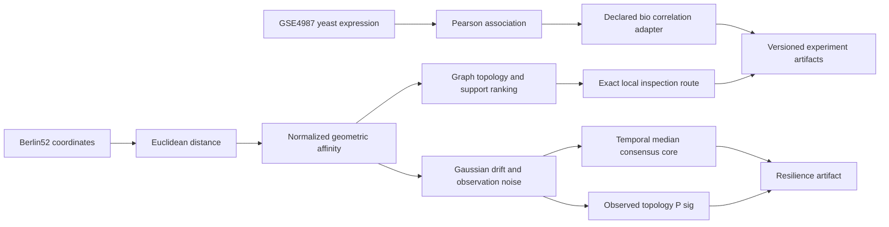

# Architecture des graphes RATISS

L’axe Berlin52 traite une structure géométrique de benchmark. L’axe GSE4987 importe une structure descriptive de corrélation. Les deux partagent un contrat d’artefact, mais leurs unités et leur portée restent distinctes.

La branche de résilience part d’une copie de l’affinité Berlin52 et injecte une dérive et un bruit de manière déclarée. Le `P_sig` observé et le noyau consensus sont exportés séparément : le consensus ne remplace pas l’observation et n’est pas utilisé pour modifier le benchmark historique.
